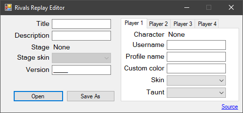

# Rivals of Aether Replay Editor

A GUI solution to editing Rivals of Aether replay data.

## About The Project
This project was created with [Visual Studio](https://visualstudio.microsoft.com/) using [.NET](https://dotnet.microsoft.com/en-us/learn/dotnet/what-is-dotnet) and [C#](https://docs.microsoft.com/en-us/dotnet/csharp/). It provides an interface to easily edit and view the data inside a replay file (.roa). 

## Credits
[mjsonofharry/replay](https://github.com/mjsonofharry/replay) - indices of various bits of information

Downiel#0101 - indepth replay file analysis ([link](https://docs.google.com/document/d/1qGwqXhZXxmAzcsilrkXvHqWEc55gQoMAeGVLWRdy_ak/edit#))